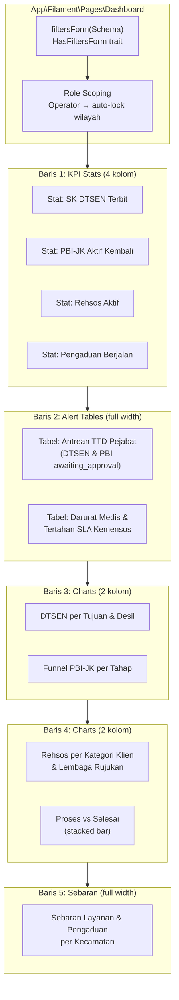

# Rencana Aksi: Dashboard SAPA SOSIAL — Filament v5

## Konteks

| Komponen | Versi |
|---|---|
| Laravel | 13.17 |
| Filament | 5.8 |
| Livewire | 4.4 |
| PHP | 8.4 |
| Database | PostgreSQL |

### Kondisi Saat Ini

**Sudah ada (4 widget dasar):**

| Widget | File | Fungsi | Kekurangan |
|---|---|---|---|
| `StatsOverview` | [`StatsOverview.php`](file:///d:/laragon/www/app-layanan/app/Filament/Widgets/StatsOverview.php) | 4 stat card (DTSEN terbit, PBI aktif, Rehsos aktif, Pengaduan berjalan) | Tidak responsif terhadap filter, query belum memakai scope wilayah |
| `EmergencyPbiWidget` | [`EmergencyPbiWidget.php`](file:///d:/laragon/www/app-layanan/app/Filament/Widgets/EmergencyPbiWidget.php) | Tabel pengajuan darurat & menunggu persetujuan | Tidak ada indikator SLA / hari tertahan |
| `ServiceRequestsChart` | [`ServiceRequestsChart.php`](file:///d:/laragon/www/app-layanan/app/Filament/Widgets/ServiceRequestsChart.php) | Doughnut distribusi per jenis layanan | Tidak ada breakdown per status/wilayah |
| `ComplaintStatusChart` | [`ComplaintStatusChart.php`](file:///d:/laragon/www/app-layanan/app/Filament/Widgets/ComplaintStatusChart.php) | Bar chart status pengaduan | Statis, tanpa filter |

**Belum ada:**
- Custom Dashboard page (masih pakai default `Filament\Pages\Dashboard`)
- Filter global (periode, wilayah, jenis layanan)
- Role-based scoping (Operator terkunci ke wilayah)
- Widget: DTSEN per tujuan/desil, funnel PBI-JK, rehsos per kategori/lembaga rujukan, sebaran wilayah
- Halaman laporan berkala (ekspor Excel/PDF)

### Kebutuhan PRD (Bagian 3)

| # | Widget Dashboard | Status |
|---|---|---|
| 1 | SK DTSEN diterbitkan (per tujuan & desil) | ❌ Belum ada |
| 2 | SK DTSEN menunggu tanda tangan | ⚠️ Sebagian (ada di StatsOverview sebagai angka, belum ada tabel antrean) |
| 3 | Reaktivasi PBI-JK per tahap | ❌ Belum ada |
| 4 | Reaktivasi darurat medis | ✅ Ada (EmergencyPbiWidget), perlu indikator SLA |
| 5 | Kasus rehsos aktif (per kategori & rujukan) | ❌ Belum ada |
| 6 | Pengajuan & pengaduan masuk (per periode) | ⚠️ Sebagian (chart ada, tapi tanpa filter periode) |
| 7 | Dalam proses vs selesai | ❌ Belum ada |
| 8 | Sebaran per wilayah (kecamatan/desa) | ❌ Belum ada |
| 9 | Filter global (periode, layanan, status, wilayah) | ❌ Belum ada |
| 10 | Operator scoping (hanya lihat wilayahnya) | ❌ Belum ada |

---

## Arsitektur Dashboard



---

## Fase & Langkah Eksekusi

### Fase 1 — Custom Dashboard Page + Filter Global

> **Goal:** Mengganti default Dashboard dengan custom page yang memiliki filter periode, jenis layanan, kecamatan, dan desa.

#### Langkah 1.1 — Buat `App\Filament\Pages\Dashboard`

**File:** `app/Filament/Pages/Dashboard.php` *(baru)*

- Extend `Filament\Pages\Dashboard`
- Use trait `Filament\Pages\Dashboard\Concerns\HasFiltersForm`
- Override `filtersForm(Schema $schema)` dengan komponen:

| Filter | Komponen | Keterangan |
|---|---|---|
| Periode Awal | `DatePicker::make('startDate')` | Default: awal bulan ini |
| Periode Akhir | `DatePicker::make('endDate')` | Default: hari ini |
| Jenis Layanan | `Select::make('service_type_id')` | Opsi dari `ServiceType::pluck('name', 'id')` |
| Kecamatan | `Select::make('district_id')` | Reactive, trigger update opsi desa |
| Desa | `Select::make('village_id')` | Opsi bergantung pada `district_id` |

- Override `getColumns()` → return `['md' => 2, 'xl' => 4]`

#### Langkah 1.2 — Role-Based Auto-Lock Filter

Di dalam `filtersForm()`:

```php
// Jika user adalah Operator Kecamatan/Desa
$user = auth()->user();

Select::make('district_id')
    ->default($user->district_id)
    ->disabled(fn () => filled($user->district_id))
    // ...

Select::make('village_id')
    ->default($user->village_id)
    ->disabled(fn () => filled($user->village_id))
    // ...
```

#### Langkah 1.3 — Daftarkan di Panel

Update [`AdminPanelProvider.php`](file:///d:/laragon/www/app-layanan/app/Providers/Filament/AdminPanelProvider.php):

```diff
 ->pages([
-    Dashboard::class,
+    \App\Filament\Pages\Dashboard::class,
 ])
```

---

### Fase 2 — Refaktor Widget: Filter-Aware + Role Scoping

> **Goal:** Semua widget merespons filter global dan membatasi data sesuai hak akses operator.

#### Langkah 2.1 — Buat Base Concern / Trait Helper

**File:** `app/Filament/Widgets/Concerns/HasDashboardFilters.php` *(baru)*

Trait ini:
- Use `Filament\Widgets\Concerns\InteractsWithPageFilters` (akses `$this->pageFilters`)
- Menyediakan helper methods:

```php
protected function getFilterStartDate(): ?Carbon;  // dari pageFilters['startDate']
protected function getFilterEndDate(): ?Carbon;     // dari pageFilters['endDate']
protected function getFilterServiceTypeId(): ?int;
protected function getFilterDistrictId(): ?int;
protected function getFilterVillageId(): ?int;

// Scope builder — diterapkan ke query ServiceRequest, Complaint, dll
protected function applyDateFilter(Builder $query, string $dateColumn = 'submitted_at'): Builder;
protected function applyRegionFilter(Builder $query, string $villageRelation = 'village'): Builder;
```

`applyRegionFilter` juga harus enforce operator scoping:

```php
$user = auth()->user();
if (filled($user->district_id)) {
    $query->whereHas($villageRelation, fn ($q) => $q->where('district_id', $user->district_id));
}
if (filled($user->village_id)) {
    $query->where('village_id', $user->village_id);
}
```

#### Langkah 2.2 — Refaktor [`StatsOverview`](file:///d:/laragon/www/app-layanan/app/Filament/Widgets/StatsOverview.php)

- Tambah trait `HasDashboardFilters`
- Semua query menggunakan `applyDateFilter()` + `applyRegionFilter()`
- Tambah chart sparkline 7 hari terakhir pada setiap Stat via `->chart([...])`

**Query yang perlu diubah:**

| Stat | Query Saat Ini | Perubahan |
|---|---|---|
| SK DTSEN Terbit | `DtsenCertificate::whereNotNull('certificate_number')->count()` | Filter periode `issued_at`, wilayah via `serviceRequest.village` |
| Menunggu TTD | `ServiceRequest::where('status', AwaitingApproval)->count()` | Filter wilayah |
| PBI Aktif | `PbiReactivation::whereNotNull('reactivated_date')->count()` | Filter periode `reactivated_date`, wilayah |
| Darurat Medis | `ServiceRequest::where('is_priority', true)->count()` | Filter wilayah |
| Rehsos Aktif | `RehabilitationCase::whereNotIn('status', [Closed])->count()` | Filter wilayah via `client.village` |
| Pengaduan | `Complaint::whereIn('status', [...])->count()` | Filter periode `reported_at`, wilayah |

#### Langkah 2.3 — Refaktor [`EmergencyPbiWidget`](file:///d:/laragon/www/app-layanan/app/Filament/Widgets/EmergencyPbiWidget.php)

- Tambah trait `HasDashboardFilters`, terapkan scope di query
- Tambah kolom **"Hari Tertahan"**: `TextColumn::make('days_stuck')` dihitung dari `submitted_at` vs `now()`, highlight merah jika > SLA
- Tambah kolom **status `proposed_to_ministry`** dengan indikator SLA dari `pbiReactivation.proposed_to_ministry_at`

#### Langkah 2.4 — Refaktor [`ServiceRequestsChart`](file:///d:/laragon/www/app-layanan/app/Filament/Widgets/ServiceRequestsChart.php) & [`ComplaintStatusChart`](file:///d:/laragon/www/app-layanan/app/Filament/Widgets/ComplaintStatusChart.php)

- Tambah trait `HasDashboardFilters`
- Terapkan filter periode dan wilayah

---

### Fase 3 — Widget Baru (Kebutuhan PRD yang Belum Terpenuhi)

#### Langkah 3.1 — `PendingApprovalsWidget` (Tabel Antrean TTD Pejabat)

**File:** `app/Filament/Widgets/PendingApprovalsWidget.php` *(baru)*

- Extend `Filament\Widgets\TableWidget`
- Sort: 2, columnSpan: `'full'`
- Query: `ServiceRequest` berstatus `awaiting_approval` yang tipe-nya DTSEN atau PBI
- Kolom: nomor tiket, jenis layanan, pemohon, subjek surat, tujuan/alasan, tanggal masuk antrean, lama menunggu
- Visible hanya untuk role **Pejabat Penandatangan** (Kabid / Kadis)

#### Langkah 3.2 — `DtsenAnalyticsChart` (SK DTSEN per Tujuan & Desil)

**File:** `app/Filament/Widgets/DtsenAnalyticsChart.php` *(baru)*

- Extend `Filament\Widgets\ChartWidget`, tipe `bar`
- Trait `HasDashboardFilters`
- Dataset 1: Grouped bar — jumlah SK terbit per `DtsenPurpose` (SPMB, PIP, KIP Kuliah, dll.)
- Dataset 2: Distribusi per desil (1–10)
- Data source:

```php
DtsenCertificate::query()
    ->whereNotNull('certificate_number')
    ->when($startDate, fn ($q) => $q->where('issued_at', '>=', $startDate))
    ->when($endDate, fn ($q) => $q->where('issued_at', '<=', $endDate))
    // region filter via serviceRequest.village
    ->selectRaw('dtsen_purpose_id, count(*) as total')
    ->groupBy('dtsen_purpose_id')
    ->get();
```

#### Langkah 3.3 — `PbiStageFunnelChart` (Reaktivasi PBI-JK per Tahap)

**File:** `app/Filament/Widgets/PbiStageFunnelChart.php` *(baru)*

- Extend `Filament\Widgets\ChartWidget`, tipe `bar` (horizontal)
- Menampilkan jumlah pengajuan PBI di setiap tahap status:
  - `submitted` → `eligibility_verification` → `awaiting_approval` → `recommendation_issued` → `proposed_to_ministry` → `ministry_approved` / `ministry_rejected` → `reactivated`
- Highlight warna merah pada tahap `proposed_to_ministry` yang > SLA
- Data source:

```php
ServiceRequest::whereHas('serviceType', fn ($q) => $q->where('code', 'PBI'))
    ->selectRaw("status, count(*) as total")
    ->groupBy('status')
    ->pluck('total', 'status');
```

#### Langkah 3.4 — `RehabilitationOverviewChart` (Rehsos per Kategori & Rujukan)

**File:** `app/Filament/Widgets/RehabilitationOverviewChart.php` *(baru)*

- Extend `Filament\Widgets\ChartWidget`, tipe `doughnut`
- Dataset 1: Kasus aktif per `ClientCategory` (via `client.clientCategory`)
- Dataset 2 (atau widget terpisah): Rujukan per `ReferralInstitution`

```php
RehabilitationCase::query()
    ->whereNot('status', RehabilitationCaseStatus::Closed)
    ->join('clients', 'rehabilitation_cases.client_id', '=', 'clients.id')
    ->selectRaw('clients.client_category_id, count(*) as total')
    ->groupBy('clients.client_category_id')
    ->get();
```

#### Langkah 3.5 — `ProcessVsCompletedChart` (Dalam Proses vs Selesai)

**File:** `app/Filament/Widgets/ProcessVsCompletedChart.php` *(baru)*

- Extend `Filament\Widgets\ChartWidget`, tipe `bar` (stacked)
- Menampilkan per jenis layanan: berapa banyak tiket *dalam proses* vs *selesai* vs *ditolak*
- Data source: `ServiceRequest` grouped by `service_type_id` dan status category

#### Langkah 3.6 — `RegionalDistributionChart` (Sebaran per Kecamatan)

**File:** `app/Filament/Widgets/RegionalDistributionChart.php` *(baru)*

- Extend `Filament\Widgets\ChartWidget`, tipe `bar`
- columnSpan: `'full'`
- X-axis: Nama kecamatan
- Y-axis stacked: jumlah pengajuan layanan + jumlah pengaduan per kecamatan
- Data source:

```php
// Pengajuan per kecamatan
ServiceRequest::query()
    ->join('villages', 'service_requests.village_id', '=', 'villages.id')
    ->join('districts', 'villages.district_id', '=', 'districts.id')
    ->selectRaw('districts.name as district_name, count(*) as total')
    ->groupBy('districts.name')
    ->pluck('total', 'district_name');

// Pengaduan per kecamatan (query serupa untuk complaints)
```

---

### Fase 4 — Optimasi Performa

#### Langkah 4.1 — Lazy Loading Widget

Pada setiap widget baru dan yang direfaktor:

```php
protected static bool $isLazy = true;
```

#### Langkah 4.2 — Polling Interval

Widget operasional (stats, tabel alert):

```php
protected static ?string $pollingInterval = '60s';
```

Widget analitik (chart): polling lebih jarang atau `null` (manual refresh).

#### Langkah 4.3 — Query Optimization

- Pastikan semua aggregation memakai `selectRaw()` + `groupBy()` langsung di PostgreSQL, bukan load semua model ke memory
- Verifikasi index yang sudah ada di kolom: `status`, `village_id`, `service_type_id`, `submitted_at`, `reported_at`, `issued_at`
- Tambahkan composite index jika diperlukan:

```php
// Contoh migration
$table->index(['service_type_id', 'status', 'submitted_at']);
```

---

### Fase 5 — Halaman Laporan Berkala

> **Goal:** 5 laporan wajib sesuai PRD, dengan filter periode dan ekspor Excel/PDF.

#### Langkah 5.1 — Buat Filament Page `ReportIndex`

**File:** `app/Filament/Pages/ReportIndex.php` *(baru)*

- Navigation group: **Laporan**
- Tampilkan form filter (periode, kecamatan/desa)
- 5 tombol/tab generate laporan sesuai PRD:

| # | Laporan | Data Source | Breakdown |
|---|---|---|---|
| 1 | Rekap SK DTSEN | `DtsenCertificate` | Per tujuan, desil, kecamatan/desa |
| 2 | Rekap Reaktivasi PBI-JK | `PbiReactivation` + `ServiceRequest` | Per alasan, status, keputusan Kemensos, durasi rata-rata |
| 3 | Laporan Rehabilitasi Sosial | `RehabilitationCase` + `Referral` | Per kategori klien, lembaga tujuan, status |
| 4 | Laporan Pelayanan | `ServiceRequest` | Per jenis layanan, status, wilayah |
| 5 | Laporan Pengaduan | `Complaint` | Per kategori, status, kecamatan/desa |

#### Langkah 5.2 — Implementasi Ekspor

- **Excel:** Filament Export Action atau `maatwebsite/excel` *(konfirmasi kompatibilitas Filament v5 dulu)*
- **PDF:** `barryvdh/laravel-dompdf` atau `spatie/laravel-pdf`
- Gunakan Laravel Queue (`database` driver) untuk laporan besar agar tidak timeout

---

### Fase 6 — Testing & Finalisasi

#### Langkah 6.1 — Feature Test Dashboard

**File:** `tests/Feature/Filament/DashboardTest.php` *(baru via `php artisan make:test`)*

| Test Case | Apa yang Diuji |
|---|---|
| `test_admin_can_access_dashboard` | Admin bisa buka `/admin` |
| `test_dashboard_shows_stats_widgets` | Stat cards ter-render |
| `test_filters_affect_widget_data` | Ubah filter → angka berubah |
| `test_operator_sees_only_own_region` | Operator Kanigoro tidak melihat data kecamatan lain |
| `test_pejabat_sees_pending_approvals` | Widget antrean TTD hanya visible untuk Pejabat Penandatangan |

#### Langkah 6.2 — Pint Formatting

```bash
vendor/bin/pint --dirty --format agent
```

---

## Ringkasan File yang Akan Dibuat/Diubah

### File Baru

| # | Path | Deskripsi |
|---|---|---|
| 1 | `app/Filament/Pages/Dashboard.php` | Custom dashboard page dengan filter global |
| 2 | `app/Filament/Widgets/Concerns/HasDashboardFilters.php` | Shared trait untuk filter + region scoping |
| 3 | `app/Filament/Widgets/PendingApprovalsWidget.php` | Tabel antrean TTD pejabat |
| 4 | `app/Filament/Widgets/DtsenAnalyticsChart.php` | Chart DTSEN per tujuan & desil |
| 5 | `app/Filament/Widgets/PbiStageFunnelChart.php` | Chart funnel PBI-JK per tahap |
| 6 | `app/Filament/Widgets/RehabilitationOverviewChart.php` | Chart rehsos per kategori & rujukan |
| 7 | `app/Filament/Widgets/ProcessVsCompletedChart.php` | Chart proses vs selesai per layanan |
| 8 | `app/Filament/Widgets/RegionalDistributionChart.php` | Chart sebaran per kecamatan |
| 9 | `app/Filament/Pages/ReportIndex.php` | Halaman laporan berkala |
| 10 | `tests/Feature/Filament/DashboardTest.php` | Test suite dashboard |

### File Diubah (Refaktor)

| # | Path | Perubahan |
|---|---|---|
| 1 | [`AdminPanelProvider.php`](file:///d:/laragon/www/app-layanan/app/Providers/Filament/AdminPanelProvider.php) | Ganti page Dashboard + tambah navigation group Laporan |
| 2 | [`StatsOverview.php`](file:///d:/laragon/www/app-layanan/app/Filament/Widgets/StatsOverview.php) | Tambah trait filter, query responsive, sparkline |
| 3 | [`EmergencyPbiWidget.php`](file:///d:/laragon/www/app-layanan/app/Filament/Widgets/EmergencyPbiWidget.php) | Tambah trait filter, kolom SLA, region scope |
| 4 | [`ServiceRequestsChart.php`](file:///d:/laragon/www/app-layanan/app/Filament/Widgets/ServiceRequestsChart.php) | Tambah trait filter |
| 5 | [`ComplaintStatusChart.php`](file:///d:/laragon/www/app-layanan/app/Filament/Widgets/ComplaintStatusChart.php) | Tambah trait filter |

---

## Estimasi Urutan Pengerjaan

```
Fase 1 (Dashboard Page + Filter)  ← Mulai dari sini
  ↓
Fase 2 (Refaktor 4 widget existing)
  ↓
Fase 3 (6 widget baru)
  ↓
Fase 4 (Optimasi performa)
  ↓
Fase 5 (Halaman laporan)
  ↓
Fase 6 (Testing + Pint)
```
